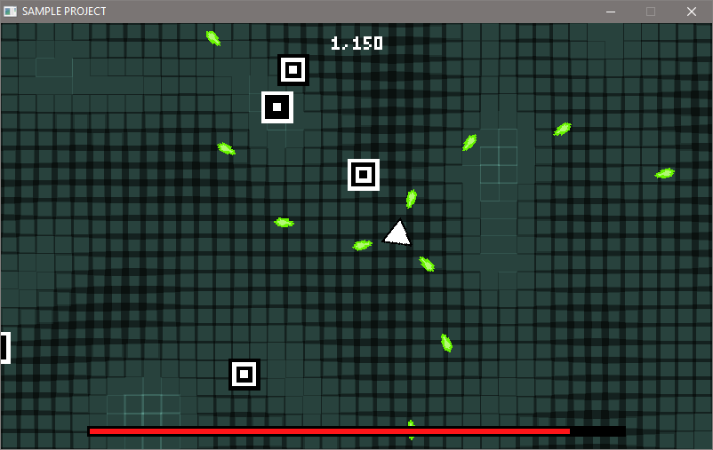
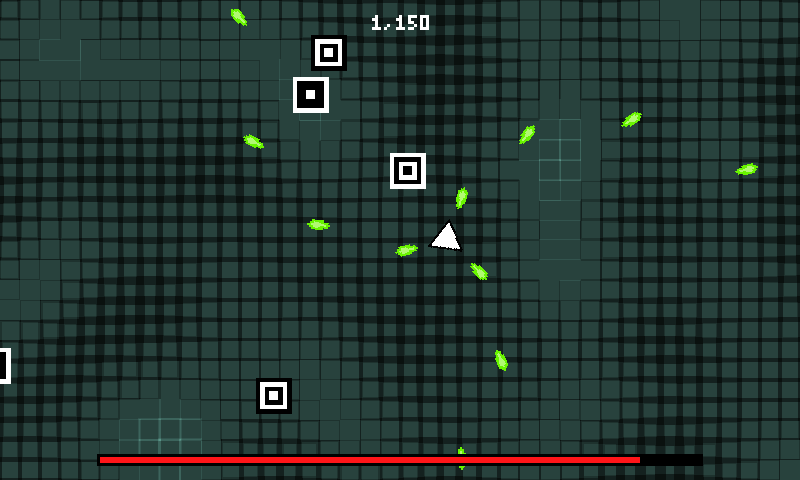

# Window-Washer
Strips the window border and title bar from a screenshot image in-place.

Before:

After:

Supported formats are PNG, BMP, TGA, and JPEG.  

[stb_image](https://github.com/nothings/stb/blob/master/stb_image.h) and [stb_image_write](https://github.com/nothings/stb/blob/master/stb_image_write.h) are doing the heavy lifting here.

## Usage
Window-Washer.exe filename
## License
Distributed under the MIT License. See [`LICENSE`](LICENSE) for more information.
## Contact
Andrew Krause - ajkrause@gmail.com

Project Link: [https://github.com/scgrn/Window-Washer](https://github.com/scgrn/Window-Washer)
